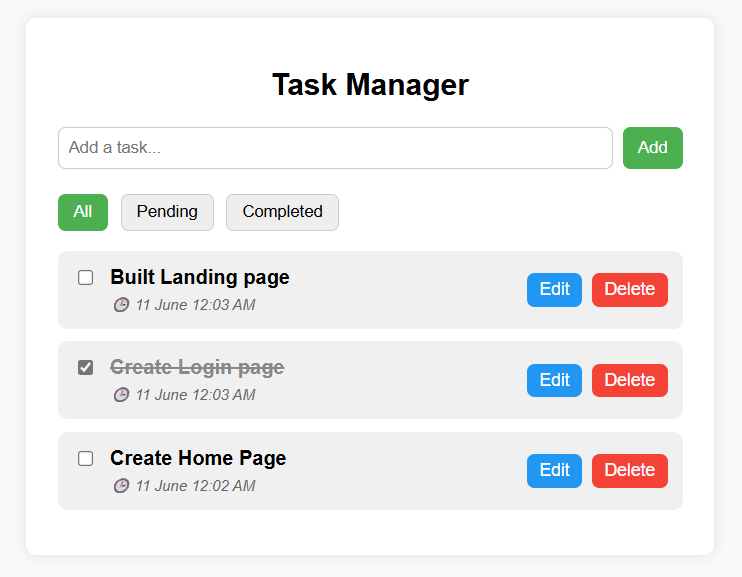

# 📝 React Task Management Application

A simple and stylish task management app built with **ReactJS**. It allows users to add, edit, delete, mark complete, and filter tasks. Tasks are also persisted using **localStorage** and come with due dates, creation timestamps, and confirmation modals.

---

## 🚀 Features

- ✅ Add new tasks with optional due date
- ✅ Mark tasks as completed or pending
- ✏️ Edit task text
- 🗑️ Delete tasks with confirmation modal
- 🕐 Shows creation date in `12-hour format` (e.g., `10 June 10:30 PM`)
- 📂 Filter tasks: **All / Completed / Pending**
- 💾 Persistent storage using `localStorage`

---

## 🖼️ UI Preview



---

## 🛠️ Technologies Used

- ReactJS
- CSS (custom styling)
- HTML
- JavaScript (ES6+)
- localStorage 

---

## 📦 Installation

```
git clone https://github.com/Inshiya1904/Task-Management-Application.git
cd Task-Management-Application
```

### Clone the repository

```bash
git clone https://github.com/yourusername/task-manager-app.git
cd task-manager-app
